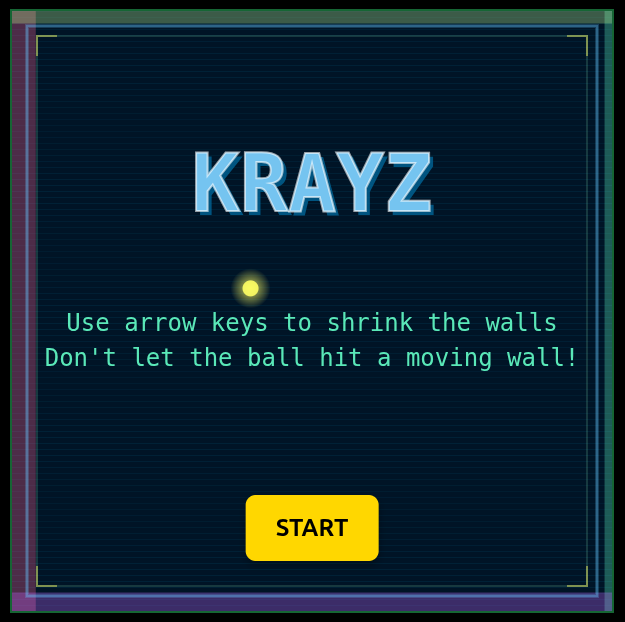

[](https://circleci.com/gh/dredtrake/krayz/tree/main)

# KraYz

A retro-style arcade game inspired by classic games like Qix, built with React and Canvas API.



## About

This project recreates the nostalgic experience of playing classic boundary-filling games from the Amstrad CPC era. As a young kid, I remember playing this type of game on my 6128 Amstrad computer - the kind of simple yet addictive gameplay that defined early gaming.

## How to Play

**Objective**: Cover as much area as possible by shrinking the walls while avoiding the bouncing ball!

**Controls**:
- Use **arrow keys** to shrink the walls
- The ball will bounce off the walls
- If the ball hits a wall while you're moving it, game over!
- You have 100 seconds to cover as much area as possible

**Scoring System**:
- **Coverage Points**: 100 points per 1% of area covered
- **Efficiency Bonus**: Extra points for covering more area quickly
- **Final Score**: Your performance is ranked from BEGINNER to LEGENDARY!

## Features

- 🎮 Smooth 60 FPS gameplay
- 🎨 Retro CRT-style visual effects
- 💥 Explosive particle effects
- 📊 Real-time score tracking with animated counter
- ⏱️ Countdown timer with visual warnings
- 🏆 Ranking system based on performance
- ⏸️ Pause/Resume functionality

## Play Online

[Check the live demo here!](https://dredtrake.github.io/krayz/)

## Development

This project was bootstrapped with [Create React App](https://github.com/facebook/create-react-app).

### Available Scripts

```bash
# Install dependencies
npm install

# Start development server
npm start

# Build for production
npm run build

# Run tests
npm test

# Deploy to GitHub Pages
npm run deploy
```

### Tech Stack

- React (with Hooks)
- HTML5 Canvas API
- Tailwind CSS
- ESLint & Prettier for code consistency
- Husky for pre-commit hooks
- Jest for testing

## Contributing

Feel free to open issues or submit pull requests if you'd like to contribute to the game!
